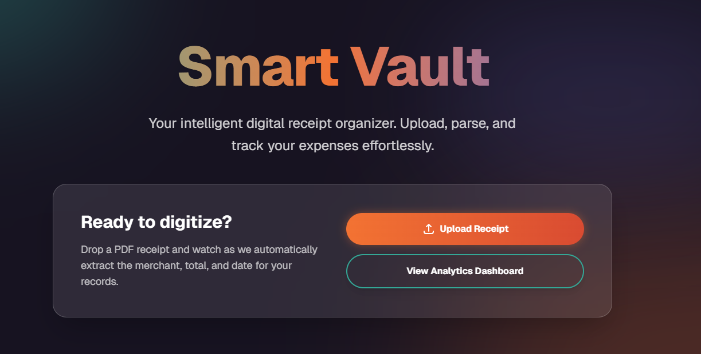

# Smart Vault

Smart Vault is an intelligent digital receipt organizer. It allows users to upload PDF receipts, extracts relevant metadata (merchant, total amount, date), and provides an analytics dashboard to track expenses over time and by category.



## Technology Stack

- **Frontend**: Next.js 15 (App Router), React, Tailwind CSS v4, Recharts, Puter.js (for AI OCR).
- **Backend**: Python, FastAPI, SQLAlchemy.
- **Database**: SQLite (for lightweight local development and tests), structurally ready for PostgreSQL in production.

---

## Local Development Setup

Follow these steps exactly to get both the frontend and backend up and running locally.

### 1. Backend Setup (FastAPI)

1. Open your Command Prompt (`cmd`) and navigate to the backend directory:
   ```cmd
   cd c:\Coding\smart-vault\backend
   ```
2. Create and activate a Python virtual environment:
   ```cmd
   python -m venv venv
   venv\Scripts\activate.bat
   ```
3. Install the required dependencies:
   ```cmd
   pip install -r requirements.txt
   ```
4. Start the backend server:
   You can either run the server manually:
   ```cmd
   uvicorn main:app --reload
   ```
   **OR** use the provided helper script from the root of the project:
   ```cmd
   cd ..
   run_backend.bat
   ```

The backend API will be available at [http://127.0.0.1:8000](http://127.0.0.1:8000). 
You can view the interactive Swagger API documentation at [http://127.0.0.1:8000/docs](http://127.0.0.1:8000/docs).

### 2. Frontend Setup (Next.js)

1. Open a **new** Command Prompt window and navigate to the frontend directory:
   ```cmd
   cd c:\Coding\smart-vault\frontend
   ```
2. Install the Node dependencies:
   ```cmd
   npm install
   ```
3. Start the development server:
   ```cmd
   npm run dev
   ```

The frontend application will be available at [http://localhost:3000](http://localhost:3000).

---

## 🐳 Docker Setup (Production-Ready)

For a fully isolated and production-ready environment using **PostgreSQL**, use Docker Compose.

1. **Create Environment File**:
   Copy `.env.example` to `.env` and update the `DB_PASSWORD`.
2. **Build and Run**:
   ```cmd
   docker-compose up --build -d
   ```
3. **Verify**:
   - Frontend: [http://localhost:3000](http://localhost:3000)
   - Backend API: [http://localhost:8000](http://localhost:8000)
   - Database: Isolated within the `backend-net` Docker network.

**Security Controls in Docker:**
- **Non-Root Execution**: Both frontend and backend run as non-privileged users (`nextjs` and `smartuser`).
- **Network Isolation**: The PostgreSQL database is placed on an `internal` network, making it inaccessible from outside the Docker cluster.
- **Multi-Stage Builds**: Frontend builds use multi-stage layers to ensure source code and build tools are not included in the final production image.

---

## Testing (Test-Driven Development)

This project strictly adheres to Test-Driven Development (TDD) principles.

### Running Backend Tests
The backend integration tests use a lightweight in-memory SQLite database, requiring no Docker containers to run.
```cmd
cd c:\Coding\smart-vault\backend
venv\Scripts\activate.bat
set PYTHONPATH=.
pytest
```

### Running Frontend Tests
The frontend uses Jest and React Testing Library for component testing.
```cmd
cd c:\Coding\smart-vault\frontend
npm run test
```

---

## Key Features

- **Privacy-First (Zero-Knowledge) Model**: All PII redaction happens entirely in the browser. No sensitive data like SSNs or Account Numbers ever leaves your machine.
- **Interactive Privacy Editor**: Review AI-suggested redactions or manually mask sensitive areas with a custom-built crosshair drawing tool.
- **Context-Aware PII Detection**: Smart heuristic engine that differentiates between sensitive data (SSNs, DOBs) and benign metadata (transaction dates, IDs) to prevent over-redaction.
- **Smart Upload Interface**: Drag and drop PDF and Image receipts with instant format-preserving sanitation.
- **AI-Powered Parsing**: Extracts relevant receipt metadata using Puter.js AI OCR after privacy protection is applied.
- **Analytics Dashboard**: Visualize spending over time and categorical breakdowns using animated Recharts.
- **Premium UI/UX**: Designed with Gitlab and Voya color themes, incorporating glassmorphism and modern web aesthetics.

---

## 🔒 Privacy & Security

Smart Vault is designed with a **Zero-Knowledge** architecture for personal data:
- **Local OCR**: Uses Tesseract.js to identify text locally.
- **Format-Preserving Redaction**: Redacts PDFs into sanitized PDFs and Images into sanitized Images before they are transmitted to any backend or AI API.
- **Keyword Gating**: Contextual patterns (like SSNs and DOBs) are only masked if relevant labels are detected, ensuring your receipt remains readable for business purposes while protecting your identity.
- **Client-Side Generation**: Final document assembly is performed via `jsPDF` entirely in the client's memory.
